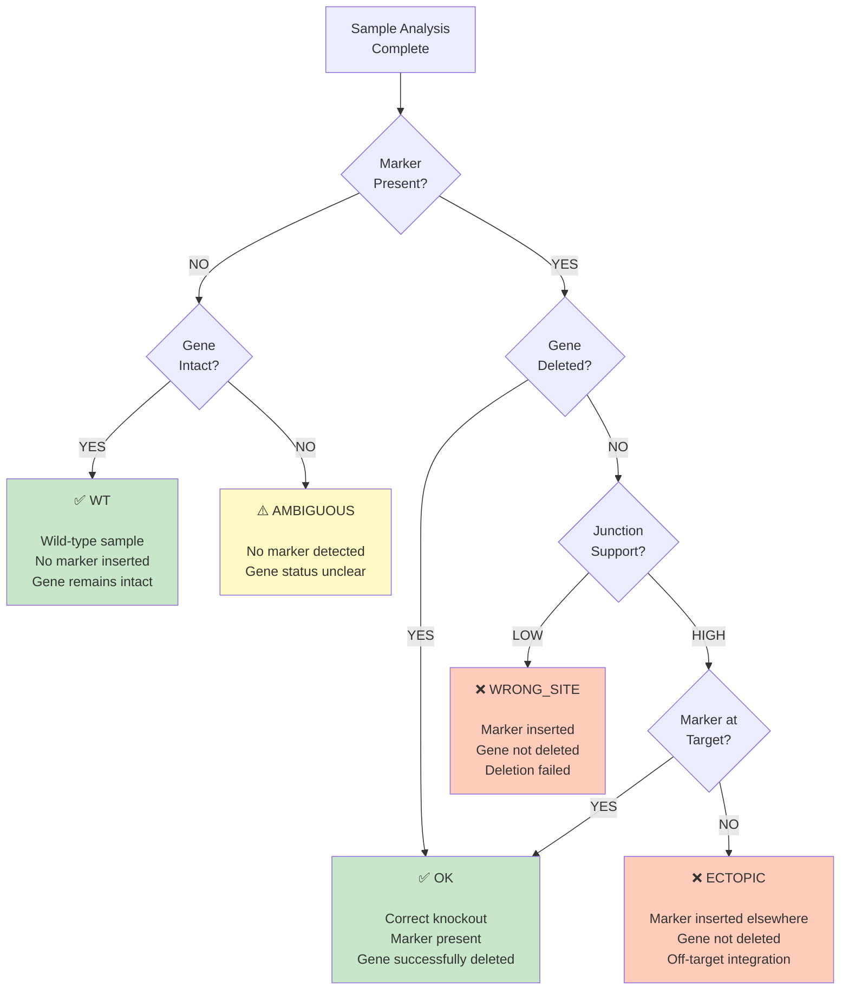

# KOCheck Sample Classification Logic

## Decision Tree



## Classification Categories

### ✅ **WT** - Wild-type (No Knockout)
- **Marker Present:** NO
- **Gene Intact:** YES
- **Interpretation:** Sample is wild-type, no genetic modification
- **Expected in:** Negative controls, unmodified parent strain

### ✅ **OK** - Correct Knockout
- **Marker Present:** YES
- **Gene Deleted:** YES (coverage_ratio < delete_ratio)
- **Interpretation:** Successful knockout - marker inserted, target gene deleted
- **Expected in:** Successfully modified knockout strains

### ❌ **WRONG_SITE** - Wrong Integration Site
- **Marker Present:** YES
- **Gene Intact:** YES (coverage_ratio > intact_ratio)
- **Junction Support:** LOW
- **Interpretation:** Marker inserted but gene not deleted, likely off-target
- **Expected in:** Failed knockout attempts with marker insertion elsewhere

### ❌ **ECTOPIC** - Ectopic Integration
- **Marker Present:** YES (detected elsewhere)
- **Gene Deleted:** YES
- **Junction Support:** HIGH (but not at target location)
- **Interpretation:** Marker integrated at wrong location while gene is deleted
- **Expected in:** Complex integrations, multiple insertion events

### ⚠️ **AMBIGUOUS** - Unclear Status
- **Marker Present:** NO
- **Gene Status:** Uncertain (coverage between delete_ratio and intact_ratio)
- **Interpretation:** Cannot definitively classify sample
- **Possible causes:** Low coverage, contamination, sequencing quality issues
- **Action:** Review QC reports, re-sequence if needed

---

## Detailed Decision Points

### 1. **Marker Detection**
```
Marker Present? = marker_sequence aligned to reads 
                 WITH junction support at integration site
```
- Checks if marker FASTA sequence appears in aligned reads
- Validates proper junction sequences at insertion boundaries
- **Threshold:** At least 10x coverage at junctions (default)

### 2. **Gene Deletion Status**
```
Gene Deleted? = (coverage_in_target / coverage_in_flanks) < delete_ratio

Gene Intact? = (coverage_in_target / coverage_in_flanks) > intact_ratio
```
- **delete_ratio** (default: 0.1) - Below this = gene deleted
- **intact_ratio** (default: 0.5) - Above this = gene intact
- **Between these thresholds** = ambiguous

### 3. **Junction Support**
```
Junction Support = coverage at marker/genome junctions
Proper junctions = both left AND right flanks present
```
- Validates marker integration is at expected location
- Confirms correct insertion orientation
- Detects partial or malformed insertions

### 4. **Target Location Verification**
```
Marker at Target? = marker junctions match target_gene.bed coordinates
                    (within flanking region)
```
- Confirms marker is at intended integration site
- Distinguishes target integration from ectopic events

---

## Example Classifications

### Example 1: Successful Knockout
- Marker sequence: **Found** (10x coverage at junctions)
- Coverage ratio: **0.05** (< 0.1 delete threshold)
- Gene: **Deleted** ✓
- Junction location: **Matches target BED** ✓
- **Classification: OK** ✅

### Example 2: Wild-type Control
- Marker sequence: **Not found**
- Coverage ratio: **0.95** (> 0.5 intact threshold)
- Gene: **Intact** ✓
- Marker: **Absent** ✓
- **Classification: WT** ✅

### Example 3: Wrong Integration Site
- Marker sequence: **Found** (8x coverage)
- Coverage ratio: **0.92** (> 0.5 intact threshold)
- Gene: **Intact** (not deleted)
- Marker present but gene not deleted
- **Classification: WRONG_SITE** ❌

### Example 4: Ectopic Integration
- Marker sequence: **Found** (15x coverage, but NOT at target)
- Coverage ratio: **0.05** (< 0.1 delete threshold)
- Gene: **Deleted** ✓
- Junction location: **Does NOT match target** ✗
- **Classification: ECTOPIC** ❌

### Example 5: Low Quality/Ambiguous
- Marker sequence: **Unclear**
- Coverage ratio: **0.30** (between 0.1 and 0.5)
- Gene: **Ambiguous status**
- Cannot classify with confidence
- **Classification: AMBIGUOUS** ⚠️
- **Action:** Check QC reports, review coverage plots

---

## Parameter Tuning

### Adjusting Detection Sensitivity

**To make deletion detection more strict:**
```bash
--delete_ratio 0.05    # Only 5% coverage = deletion
--intact_ratio 0.75    # Must have 75% coverage = intact
```

**To be more lenient:**
```bash
--delete_ratio 0.20    # Up to 20% coverage = deletion
--intact_ratio 0.30    # Need at least 30% coverage = intact
```

**For low-coverage data:**
```bash
--delete_ratio 0.15
--intact_ratio 0.40
--min_mapq 15          # Accept lower quality alignments
```

---

## Visualization

Coverage plots in `results/plots/` show:
- **Target gene region** (gray box)
- **Flanking regions** (light gray)
- **Coverage profile** (line graph)
- **Classification** based on coverage ratio

This visual inspection can help validate classifications and troubleshoot ambiguous cases.
