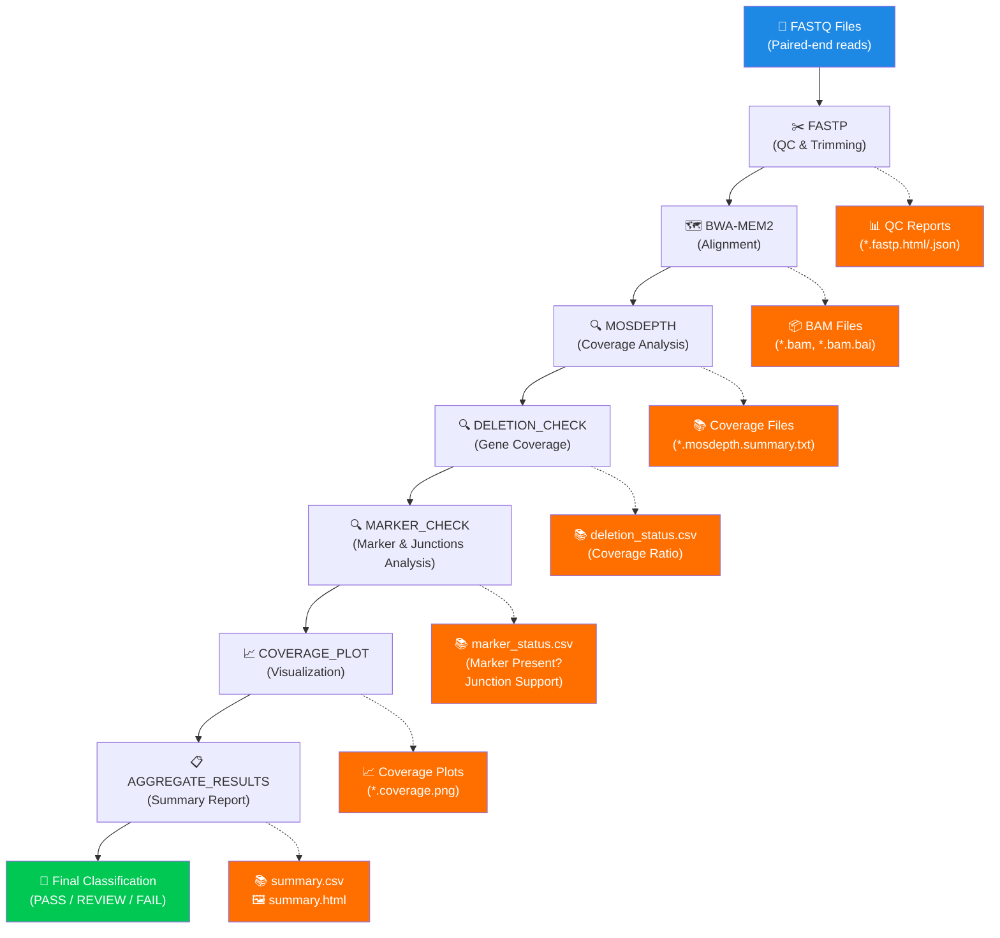

# KOCheck Pipeline Workflow

## Data Flow Diagram



## Processing Steps

### 1. **FASTP - Quality Control** 
- Removes adapters from reads
- Trims low-quality bases
- Generates QC reports
- Output: Cleaned FASTQ files

### 2. **BWA-MEM2 - Alignment**
- Maps reads to reference genome
- Creates BAM files with alignment coordinates
- Outputs sorted, indexed BAM files
- Output: `*.bam`, `*.bam.bai`

### 3. **MOSDEPTH - Coverage Analysis**
- Calculates per-base coverage across genome
- Generates coverage summary statistics
- Creates BED files for coverage regions
- Output: Coverage summary files

### 4. **DELETION_CHECK - Gene Status**
- Compares coverage in target gene vs. flanking regions
- Calculates coverage ratio
- **Classification:**
  - **"deleted"**: coverage_ratio < delete_ratio (default 0.1)
  - **"intact"**: coverage_ratio > intact_ratio (default 0.5)
  - **"ambiguous"**: between thresholds

### 5. **MARKER_CHECK - Marker Validation**
- Checks if marker sequence is present in reads
- Analyzes junction support (proper marker integration)
- Detects ectopic insertions (marker elsewhere in genome)
- **Classification:**
  - **"present"**: marker detected with junction support
  - **"absent"**: no marker detected
  - **"ectopic"**: marker present but wrong location

### 6. **COVERAGE_PLOT - Visualization**
- Generates PNG plots of coverage across target region
- Shows target gene, flanking regions, coverage profile
- Output: `*.png` coverage plots

### 7. **AGGREGATE_RESULTS - Final Report**
- Combines results from all samples
- Creates summary CSV and HTML reports
- Final classification for each sample
- Output: `summary.csv`, `summary.html`

## Output Files

```
results/
├── qc/                          # Quality control reports
│   ├── *.fastp.html
│   └── *.fastp.json
├── mapping/                     # Aligned reads
│   ├── *.bam
│   └── *.bam.bai
├── coverage/                    # Coverage analysis
│   ├── *.mosdepth.summary.txt
│   ├── *.per-base.bed.gz
│   └── *.regions.bed.gz
├── deletion_check/              # Deletion classification
│   └── deletion_status.csv
├── marker_check/                # Marker validation
│   └── marker_status.csv
├── plots/                       # Coverage visualizations
│   └── *.coverage.png
└── summary/                     # Final reports
    ├── summary.csv              # ⭐ Main results table
    └── summary.html             # ⭐ Interactive HTML report
```

## Sample Classification Logic

See `CLASSIFICATION_LOGIC.md` for detailed classification rules.
