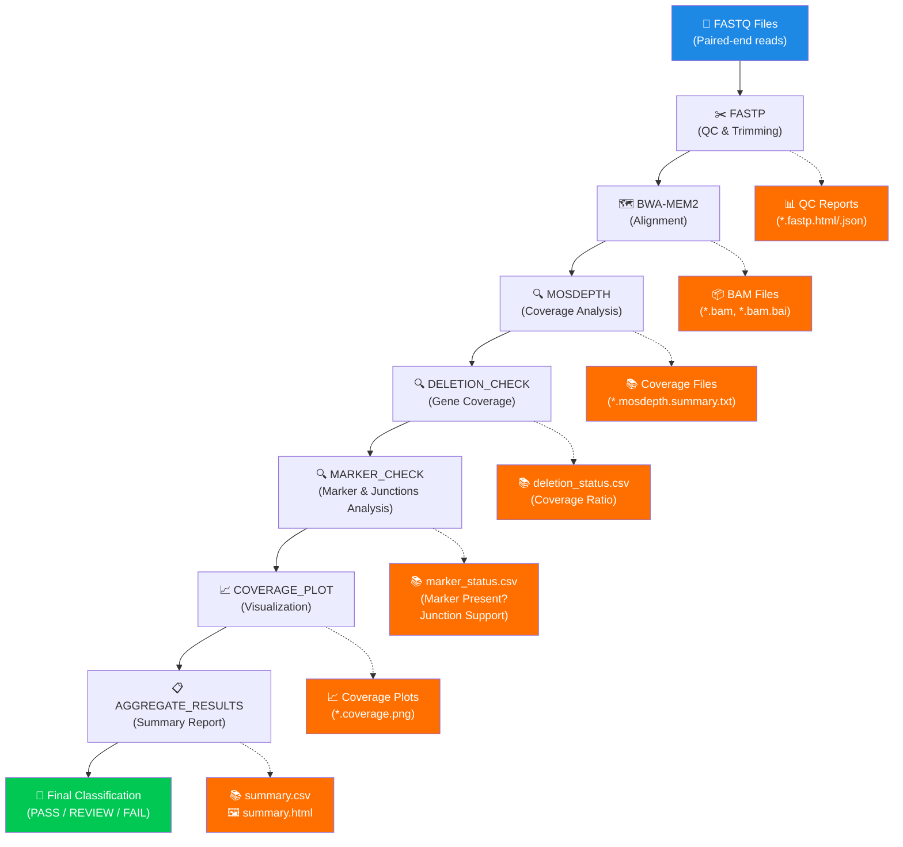
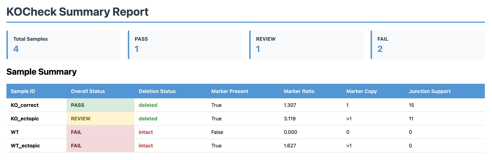
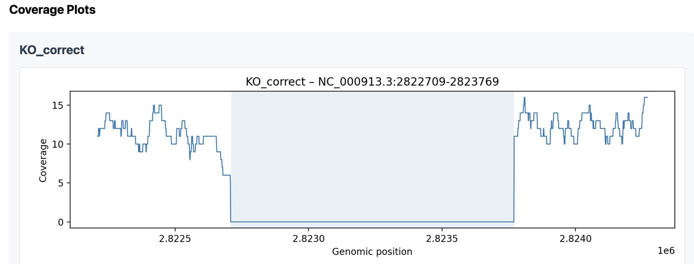

# KOCheck ✅

A reproducible [Nextflow](https://www.nextflow.io/) pipeline for validating genetic knockouts. KOCheck analyzes short-read (Illumina) sequencing reads to confirm gene deletions, detect correct resistance marker insertion, and identify ectopic integrations across the genome. Designed primarily for microbiological and fungal genetic workflows.

## Features

- **Quality Control**: Automatic adapter trimming and quality filtering with [fastp](https://github.com/OpenGene/fastp)
- **Deletion Detection**: Validates gene deletion by comparing target gene coverage to chromosomal mean
- **Marker Validation**: Confirms presence and copy number of resistance marker
- **Ectopic Integration Detection**: Identifies off-target marker insertions using junction support analysis
- **Coverage Visualization**: Generates coverage plots for the target gene region
- **Comprehensive Reporting**: CSV outputs for deletion status and marker presence
- **Summary Reports**: Aggregated CSV and interactive HTML report with all sample results and embedded coverage plots

## Quick Start (Easiest Method)

**For users with minimal command-line experience:**

The easiest way to run KOCheck is using the graphical interface which is launched via a Python script and utilizes a Docker image. This method requires only [Docker](https://docs.docker.com/desktop/) and [Python](https://www.python.org/downloads/) to be installed on your system.

1. **Download the GUI launcher**
[Download run_kocheck_gui.py](https://raw.githubusercontent.com/meadm/KOCheck/main/run_kocheck_gui.py)

2. **Make sure Docker is installed and running**
In a terminal type:
```bash
docker run hello-world
```
If Docker is working, you'll see a message starting with:
```bash
Hello from Docker!
```

3. In a terminal run:
```bash
   python run_kocheck_gui.py
```

The GUI will open in a new window where you can:
- Select input files through a file browser
- Configure parameters using simple inputs
- Monitor pipeline progress
- Receive a pop-up notification when the pipeline is complete

**Note:** The GUI should work natively on macOS, Windows, and Linux desktop systems. If the GUI doesn't display, you can run the pipeline directly via Docker or Nextflow on the command line (see below).

## Installation Options

### Option 1: Docker (Recommended)

The Docker image (`meadm/kocheck:latest`) contains all dependencies pre-installed. You only need Docker installed on your system.

1. Pull Docker image
```bash
docker pull meadm/kocheck:latest
```

### Option 2: Local Installation

If you already have [Nextflow](https://www.nextflow.io/docs/latest/install.html)(or are able to make a minimal conda environment containing it - see below), [Conda](https://conda-forge.org/download/), and [Docker](https://docs.docker.com/desktop/) installed on your computer, you can run the pipeline directly without using the Docker image. This is useful if you want to modify the pipeline or prefer running Nextflow natively.

**Requirements:**
- Nextflow (>= 22.10.0)
  - Java 17 or higher is required for Nextflow
- Docker and Conda (for containerized tool execution)
  - Make sure Docker is running before attempting to run the pipeline


**Installation:**

1. If Nextflow is not installed on your machine, make a minimal conda environment containing Nextflow:
```bash
conda create --name kocheck bioconda::nextflow
conda activate kocheck
```

2. Clone the repository:
```bash
git clone https://github.com/meadm/KOCheck
cd KOCheck
```

The pipeline uses Docker containers and Conda environments as specified in `conf/modules.config`. Make sure Docker is running and Conda is available when you run the pipeline locally.

## Usage

*Instructions on how to run the pipeline via a Python GUI are found above.*

### Docker Usage

Run the pipeline directly in Docker:
```bash
docker run --rm \
  -v $(pwd)/data:/data \
  -v $(pwd)/results:/output \
  meadm/kocheck:latest \
  nextflow run main.nf \
    --reads "/data/*_{R1,R2}.fq.gz" \
    --reference /data/reference.fasta \
    --gene_bed /data/target_gene.bed \
    --marker_fasta /data/marker.fasta \
    --outdir /output
```

### Local Usage (Command Line)

```bash
nextflow run main.nf \
  --reads "path/to/*_{R1,R2}.fq.gz" \
  --reference path/to/reference.fasta \
  --gene_bed path/to/target_gene.bed \
  --marker_fasta path/to/marker.fasta
```

### Example with Test Data

The repository includes test data in `assets/testdata/` that demonstrates different knockout scenarios:

**Test Samples:**
- `KO_correct_*`: Successful knockout - gene deleted, marker correctly inserted (expected category: **PASS**)
- `KO_ectopic_*`: Knockout with ectopic marker insertion - gene deleted but marker in wrong location (expected category: **REVIEW**)
- `WT_ectopic_*`: Wildtype with ectopic marker - gene intact, marker present elsewhere (expected category: **REVIEW**)
- `WT_*`: Wildtype control - gene intact, no marker (expected category: **FAIL**)

**Reference Files:**
- `ref.fasta`: Reference genome FASTA file
- `target_gene.bed`: BED file with target gene coordinates (0-based, half-open format)
- `kanR.fasta`: Resistance marker sequence (kanamycin resistance gene)

**Run the pipeline with test data:**
```bash
nextflow run main.nf \
  --reads "assets/testdata/*_{R1,R2}.fq.gz" \
  --reference assets/testdata/ref.fasta \
  --gene_bed assets/testdata/target_gene.bed \
  --marker_fasta assets/testdata/kanR.fasta \
  --marker_contig kanR
```

This will process all test samples and generate results demonstrating the different classification outcomes.

## Parameters

### Required Parameters

- `--reads`: Path pattern to paired-end FASTQ files (e.g., `"data/*_{R1,R2}.fq.gz"`)
- `--reference`: Path to reference genome FASTA file
- `--gene_bed`: Path to [BED](https://genome.ucsc.edu/FAQ/FAQformat.html#format1) file with target gene coordinates (must contain exactly one line: `chrom start end`)
- `--marker_fasta`: Path to FASTA file containing the resistance marker sequence

### Optional Parameters

- `--marker_contig`: Name of the marker contig in the combined reference (default: `kanR`)
- `--outdir`: Output directory (default: `results`)
- `--delete_ratio`: Coverage ratio threshold for deletion classification (default: `0.1`)
- `--intact_ratio`: Coverage ratio threshold for intact gene classification (default: `0.5`)
- `--flank`: Flanking region size in bp for coverage plots and junction analysis (default: `500`)
- `--min_mapq`: Minimum mapping quality for junction support analysis (default: `20`)

## Workflow

The pipeline workflow is shown below:



The pipeline consists of the following steps:

1. **[FASTP](https://github.com/OpenGene/fastp)**: Quality control and adapter trimming of paired-end reads
2. **APPEND_MARKER**: Combines reference genome with marker sequence for marker detection
3. **[BWA_MEM2](https://github.com/bwa-mem2/bwa-mem2)**: Alignment of trimmed reads to the combined reference (alignment, sorting, indexing)
4. **[MOSDEPTH](https://github.com/brentp/mosdepth)**: Coverage calculation across the genome
5. **DELETION_CHECK**: Classifies target gene as `deleted`, `intact`, or `ambiguous` based on coverage ratios
6. **COVERAGE_PLOT**: Generates visualization of coverage across the target gene region
7. **MARKER_CHECK**: Validates marker presence, estimates copy number, and detects ectopic integrations
8. **AGGREGATE_RESULTS**: Combines all sample results into a single CSV summary and generates an interactive HTML report

## Output Files

Results are organized in the `results/` directory (or custom `--outdir`):

- `qc/`: Fastp quality control reports (HTML and JSON)
- `mapping/`: Aligned BAM files and indices
- `coverage/`: Mosdepth coverage summaries and per-base coverage files
- `deletion_check/`: CSV files with deletion status for each sample
- `marker_check/`: CSV files with marker validation results including:
  - Marker presence (true/false)
  - Deletion status
  - Marker copy number estimate (0, 1, or >1)
  - Junction support score
  - Final classification status
- `plots/`: Coverage plots for each sample showing the target gene region
- `summary/`: Aggregated results including:
  - `kocheck_summary.csv`: Combined CSV with all sample results
  - `kocheck_report.html`: Interactive HTML report with summary statistics, sample table, and embedded coverage plots

### Example Outputs

The pipeline generates comprehensive visualizations and reports. Below are examples of the key outputs:

**HTML Summary Report:**
The interactive HTML report provides an overview of all samples with summary statistics, detailed sample table, and embedded coverage plots.



**Coverage Plots:**
Individual coverage plots show the coverage profile across the target gene region for each sample, with the gene region highlighted.



### Overall Status Classifications

The `MARKER_CHECK` module classifies samples into the following categories:

- `PASS`: Successful knockout - gene deleted, marker present in one copy, and strong junction support (>10)
- `FAIL`: Failed knockout - gene is still present (intact)
- `REVIEW`: Requires manual review - includes cases with:
  - Gene deleted but marker in multiple copies (including tandem insertions and/or ectopic integrations)
  - Gene deleted with single-copy marker but weak/moderate junction support
  - Other ambiguous situations where classification is unclear

## Contributing

We welcome contributions! There are several ways you can help improve KOCheck:

### Reporting Bugs

If you encounter a bug or unexpected behavior:

1. Check if the issue has already been reported in the [Issues](https://github.com/meadm/KOCheck/issues) section
2. If not, create a new issue with:
   - A clear description of the problem
   - Steps to reproduce the issue
   - Expected vs. actual behavior
   - Relevant error messages or logs
   - Your system information (OS, Nextflow version, etc.)

### Requesting Features

Have an idea for a new feature or improvement?

1. Check existing [Issues](https://github.com/meadm/KOCheck/issues) to see if it's already been requested
2. Open a new issue with:
   - A clear description of the proposed feature
   - Use case or motivation
   - Any relevant examples or references

### Contributing Code

Contributions are welcome! To contribute:

1. Fork the repository
2. Create a feature branch (`git checkout -b feature/your-feature-name`)
3. Make your changes
4. Test your changes thoroughly
5. Commit your changes (`git commit -m 'Add some feature'`)
6. Push to the branch (`git push origin feature/your-feature-name`)
7. Open a Pull Request

Please ensure your code follows the existing style and includes appropriate documentation. For major changes, please open an issue first to discuss what you would like to change.

## License

See LICENSE file for details.
